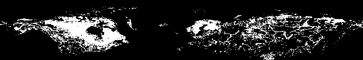

Image by <a href="https://pixabay.com/photos/?utm_source=link-attribution&amp;utm_medium=referral&amp;utm_campaign=image&amp;utm_content=1149223">Free-Photos</a> from <a href="https://pixabay.com/?utm_source=link-attribution&amp;utm_medium=referral&amp;utm_campaign=image&amp;utm_content=1149223">Pixabay</a>

### Collaborators
- Alessandro Filazzola (University of Toronto and York University)
- Sapna Sharma (York University)
- R. Iestyn Woolway (European Space Agency)
- M. Arshad Imrit (York University)


### Objective
- Evaluate patterns models of ice coverage globally with climate change

### Load packages
```{r warning=FALSE, message=FALSE}
library(raster)
library(ncdf4)
library(tidyverse)
library(ggthemes)
library(doParallel)
library(foreach)

source("functions.r")

```


### Read in files
```{r warning=FALSE, message=FALSE}
allfiles <- list.files("data//isimip_ice", full.names = T)

## Take a look at a raster
viewSample <- stack(allfiles[1])
plot(viewSample[[1]])
```

albm_gfdl-esm2m_historical_rcp26_iceend 1901 to 2099


### Check uncertainty
```{r warning=FALSE, message=FALSE}
## Load one model for example
firstModel <- stack(allfiles[1])
names(firstModel) <- paste0("Year",1901:2099) ## label year

### Raw change in timeseries
rasterDiff <- calc(firstModel, function(x) abs(diff(x)))
diffSum <- calc(rasterDiff, mean)
plot(diffSum)
meanChange <- cellStats(diffSum, mean)
errorChange <- cellStats(diffSum, sd)

### Change in value over time
rasterCumDiff <- calc(firstModel, function(x) cumsum(diff(x)))
dfdiff <- data.frame(year=1902:2099, sumDiff = cellStats(rasterCumDiff, sum))

ggplot(dfdiff, aes(x=year, y= sumDiff)) + geom_point()

m1 <- lm(sumDiff ~ year, data= dfdiff)
summary(m1)

modelOut <- data.frame(beta = coef(m1)[2], r2= summary(m1)$r.squared, pval = summary(m1)$coefficients[2,4], ## extract beta, r2, pvalue
                       linear = ifelse(shapiro.test(residuals(m1))$p.value > 0.05, "YES","NO") )

```

### Iterate uncertainty check across all models
```{r eval=FALSE}


### Create cluster
cl <- makeCluster(4, type="PSOCK")
clusterEvalQ(cl, { library(MASS); RNGkind("L'Ecuyer-CMRG") })
registerDoParallel(cores = cl)


dfOut <- foreach(i = allfiles, .combine=rbind, .packages=c("raster","ncdf4")) %dopar% {
## Load one model for example
tempModel <- brick(i)
names(tempModel) <- paste0("Year",1901:2099) ## label year

### Raw change in timeseries
rasterDiff <- calc(tempModel, function(x) abs(diff(x)))
diffSum <- calc(rasterDiff, mean)
meanChange <- cellStats(diffSum, mean)
errorChange <- cellStats(diffSum, sd)

### Change in value over time
rasterCumDiff <- calc(tempModel, function(x) cumsum(diff(x)))
dfdiff <- data.frame(year=1902:2099, sumDiff = cellStats(rasterCumDiff, sum))

## Run a linear model on change over time
m1 <- lm(sumDiff ~ year, data= dfdiff)
summary(m1)

modelOut <- data.frame(model = paste0(i),
                       beta = coef(m1)[2], r2= summary(m1)$r.squared, pval = summary(m1)$coefficients[2,4], ## extract beta, r2, pvalue
                       linear = ifelse(shapiro.test(residuals(m1))$p.value > 0.05, "YES","NO"), meanChange, errorChange)
return(modelOut)
}


modelNames <- gsub(".*_ice/", "", dfOut$model)
dfOut[,"GCM"] <- gsub("_historical.*", "", modelNames)
dfOut[,"RCP"]  <- modelNames %>%  gsub(".*historical_", "", .) %>%  gsub("_ice.*", "", .)
dfOut[,"IceMeasure"] <- modelNames %>%  gsub(".*_ice", "", .) %>%  gsub("_1901.*", "", .)

write.csv(dfOut, "data//AllmodelOut.csv", row.names=FALSE)
```

### Compare RCP and change in ice measure among models
```{r warning=FALSE, message=FALSE}
allmodelSummaries <- read.csv("data//AllmodelOut.csv")

plot1 <- ggplot(allmodelSummaries, aes(x=IceMeasure, y= meanChange)) + facet_grid(~RCP) +geom_boxplot(fill="Grey70") + theme_Publication() + ylab("Mean Change in Timeseries") + xlab("Ice Measure")
plot2 <- ggplot(allmodelSummaries, aes(x=IceMeasure, y= log(errorChange))) + facet_grid(~RCP) +geom_boxplot(fill="Grey70") + theme_Publication() + ylab("Variation in Timeseries (SD)") + xlab("Ice Measure")

plot3 <- ggplot(allmodelSummaries, aes(x=IceMeasure, y= abs(beta))) + facet_grid(~RCP) +geom_boxplot(fill="Grey70") + theme_Publication() + ylab("Annual mean of all change in timeseries") + xlab("Ice Measure")

gridExtra::grid.arrange(plot1, plot2, plot3, ncol=1)
```

### Compare predictions of the same pixels across models
```{r}
## Load first year from all rasters for ice on
iceOnFiles <- allfiles[grep("icestart", allfiles)]
firstStack <- stack(iceOnFiles, bands=1)

## get model names
GCMmodels <- iceOnFiles %>% gsub(".*_ice/", "", .) %>% gsub("_historical.*", "", .)
RCPmodels <- iceOnFiles %>% gsub(".*historical_", "", .) %>% gsub("_icestart.*", "", .)

## Calculate mean and error within a year for each model
meanChange <- calc(firstStack, mean) 
errorChange <- calc(firstStack, sd)
zscoreStack <- (firstStack-meanChange)/errorChange ## zscore each model
totalChange <- cellStats(zscoreStack, mean ) ## sum departure from the mean

## Create DF with models are difference
modelVariation <- data.frame(year = 1900+1, modelName= GCMmodels, RCP = RCPmodels, meanDeparture = totalChange)

```

### Compare predictions iterated across every year
```{r eval=FALSE}


iceOnFiles <- allfiles[grep("icestart", allfiles)]
iceEndFiles <- allfiles[grep("iceend", allfiles)]

## get model names
allmodels <- iceOnFiles %>% gsub(".*_ice/", "", .) %>% gsub("_historical.*", "", .)
GCMmodels <- gsub(".*_", "", allmodels)
lakemodels <- gsub("_.*", "", allmodels)
RCPmodels <- iceOnFiles %>% gsub(".*historical_", "", .) %>% gsub("_icestart.*", "", .)

## Convert models to text
models <- data.frame(lakemodel = lakemodels, GCM = GCMmodels, RCP = RCPmodels, filepath=iceOnFiles, stringsAsFactors = F)


## Select one RCP to examine
models85 <- subset(models, RCP=="rcp85")


### Create cluster
cl <- makeCluster(4, type="PSOCK")
clusterEvalQ(cl, { library(MASS); RNGkind("L'Ecuyer-CMRG") })
registerDoParallel(cores = cl)


iceOnOut <- foreach(i = 1:199, .combine=rbind, .packages=c("raster","ncdf4","dplyr")) %dopar% {
  foreach(j=1:4, .combine='c') %do% {

## Select subset of models
GMClist <- unique(models85$GCM)
firstGMC <- subset(models85, GCM == GMClist[j])
    
## Load first year from all rasters for ice on
firstStack <- stack(firstGMC, bands=i)

## Calculate mean and error within a year for each model
meanChange <- calc(firstStack, mean) 
errorChange <- calc(firstStack, sd)
zscoreStack <- (firstStack-meanChange)/errorChange ## zscore each model
totalChange <- cellStats(zscoreStack, mean ) ## sum departure from the mean

## Create DF with models are difference
modelVariation <- data.frame(year = 1900+i, modelName= GCMmodels, RCP = RCPmodels, meanDeparture = totalChange)
return(modelVariation)
}

iceOffOut <- foreach(i = 1:199, .combine=rbind, .packages=c("raster","ncdf4","dplyr")) %dopar% {
## Load first year from all rasters for ice on

firstStack <- stack(iceEndFiles, bands=i)

## get model names
GCMmodels <- iceEndFiles %>% gsub(".*_ice/", "", .) %>% gsub("_historical.*", "", .)
RCPmodels <- iceEndFiles %>% gsub(".*historical_", "", .) %>% gsub("_iceend.*", "", .)

## Calculate mean and error within a year for each model
meanChange <- calc(firstStack, mean) 
errorChange <- calc(firstStack, sd)
zscoreStack <- (firstStack-meanChange)/errorChange ## zscore each model
totalChange <- cellStats(zscoreStack, mean ) ## sum departure from the mean

## Create DF with models are difference
modelVariation <- data.frame(year = 1900+i, modelName= GCMmodels, RCP = RCPmodels, meanDeparture = totalChange)
return(modelVariation)
}

## Combine two models
iceOutmodels <- rbind(iceOnOut, iceOffOut)
iceOutmodels[,"iceMeasure"] <- c(rep("iceStart", nrow(iceOnOut)),rep("iceEnd",nrow(iceOffOut)))


write.csv(iceOutmodels, "data//WithinYearCompare.csv", row.names=FALSE)
```


### Compare predictions of the same pixels across models
```{r warning=FALSE, message=FALSE}
iceOutmodels <- read.csv("data//WithinYearCompare.csv", stringsAsFactors = F)

## Overall pattern in models
ggplot(iceOutmodels, aes(x=modelName, y=meanDeparture, fill=RCP)) + facet_grid(~iceMeasure) +geom_boxplot() + coord_flip() + geom_hline(yintercept = 0, lty=2) + scale_fill_manual(values=c("#E69F00", "#56B4E9", "#009E73")) + xlab("GCM model") + ylab("Mean Departure from Mean") + theme_Publication()

## Overall pattern in models with GFDL removed
ggplot(iceOutmodels %>% filter(modelName != "lake_gfdl-esm2m"), aes(x=modelName, y=meanDeparture, fill=RCP)) + facet_grid(~iceMeasure) +geom_boxplot() + coord_flip() + geom_hline(yintercept = 0, lty=2) + scale_fill_manual(values=c("#E69F00", "#56B4E9", "#009E73")) + xlab("GCM model") + ylab("Mean Departure from Mean") + theme_Publication()


## Change in time
ggplot(iceOutmodels, aes(x=year, y=meanDeparture, color=modelName)) + geom_smooth(se=F)  + ylab("Mean Departure from Mean") + theme_Publication() + facet_grid(RCP~iceMeasure)
```

### Compare map of where there is the least agreement in predictions
```{r warning=FALSE, message=FALSE}
## Load library for joining images
library(magick)

iceOnFiles <- allfiles[grep("icestart", allfiles)]
iceEndFiles <- allfiles[grep("iceend", allfiles)]

## get model names
allmodels <- iceOnFiles %>% gsub(".*_ice/", "", .) %>% gsub("_historical.*", "", .)
GCMmodels <- gsub(".*_", "", allmodels)
lakemodels <- gsub("_.*", "", allmodels)
RCPmodels <- iceOnFiles %>% gsub(".*historical_", "", .) %>% gsub("_icestart.*", "", .)

## Convert models to text
models <- data.frame(lakemodel = lakemodels, GCM = GCMmodels, RCP = RCPmodels, filepath=iceOnFiles, stringsAsFactors = F)

## Select one RCP to examine
models85 <- subset(models, RCP=="rcp85")

## different models
GMClist <- unique(models85$GCM)
lakelist <- unique(models85$lakemodel)

### Create cluster
cl <- makeCluster(4, type="PSOCK")
clusterEvalQ(cl, { library(MASS); RNGkind("L'Ecuyer-CMRG") })
registerDoParallel(cores = cl)


## set colours for plot
colors <- rev(colorspace::sequential_hcl(11, palette = "Dark Mint"))
breakpoints <- seq(0,100, length.out = 11) ## Set breakpoints

sdTimersies <- foreach(i = 1:199, .combine=stack, .packages=c("raster","ncdf4","dplyr","doParallel")) %dopar% {
  foreach(j = 1:4) %do%{


## Select subset of models
firstGMC <- subset(models85, lakemodel == lakelist[j])
    
## Load first year from all rasters for ice on
firstStack <- stack(firstGMC$filepath, bands=i)

## Calculate mean and error within a year for each model
errorChange <- calc(firstStack, sd)


png(paste("lakegif//SDmodel",lakelist[j],i+1900,".png"))
plot(errorChange, breaks=breakpoints, col=colors)
text(140,100, paste(i+1900), cex=3) 
dev.off()

## Create DF with models are difference
return(errorChange)
  }
}

stopCluster(cl) 


for(i in 1:4){
list.files(path='lakegif', pattern = paste0(lakelist[i]), full.names = TRUE) %>% 
        image_read() %>% # reads each path file
        image_join() %>% # joins image
        image_animate(fps=10) %>% # animates, can opt for number of loops
        image_write(paste0("animatedGIFs//",lakelist[i],".gif")) # write to current dir
print(i)
}

```

### Check change in latitudinal distance of observations
```{r}

iceOnFiles <- allfiles[grep("icestart", allfiles)]
iceEndFiles <- allfiles[grep("iceend", allfiles)]

## get model names
allmodels <- iceOnFiles %>% gsub(".*_ice/", "", .) %>% gsub("_historical.*", "", .)
GCMmodels <- gsub(".*_", "", allmodels)
lakemodels <- gsub("_.*", "", allmodels)
RCPmodels <- iceOnFiles %>% gsub(".*historical_", "", .) %>% gsub("_icestart.*", "", .)

## Convert models to text
models <- data.frame(lakemodel = lakemodels, GCM = GCMmodels, RCP = RCPmodels, filepath=iceOnFiles, stringsAsFactors = F)


## Select one RCP to examine
models85 <- subset(models, RCP=="rcp85")


### Create cluster
cl <- makeCluster(4, type="PSOCK")
clusterEvalQ(cl, { library(MASS); RNGkind("L'Ecuyer-CMRG") })
registerDoParallel(cores = cl)


iceStartLat <- foreach(i = 1:199, .combine=rbind, .packages=c("raster","ncdf4","dplyr","doParallel")) %dopar% {
  foreach(j=1:nrow(models), .combine=rbind) %do% {

## Select subset of models
iterModel <- subset(models, filepath == models$filepath[j])
    
## Load first year from all rasters for ice on
iterRaster <- raster(iterModel[,"filepath"], band=i)

## Convert raster to points to extract latitude
iterPoints <- rasterToPoints(iterRaster, fun = function(x) x>0, spatial=T)
meanLat <- mean(coordinates(iterPoints)[,2]) 
minLat <- min(coordinates(iterPoints)[,2]) 

dataOut <- data.frame(lakemodel = models[j,"lakemodel"], GCM = models[j,"GCM"], RCP = models[j,"RCP"],
                      Year = 1900+i, MeanLatitude = meanLat, MinimumLatitude=minLat)
return(dataOut)
  }
}

iceStartLat85 <- iceStartLat %>% filter(RCP=="rcp85")

ggplot(iceStartLat85, aes(x=Year, y=MeanLatitude)) + facet_grid(lakemodel~GCM, scales="free_y") + geom_line() + theme_Publication() + ylab("Mean latitude of pixels with lake ice (°)")

```

### Create models with difference 
```{r}
iceOnFiles <- allfiles[grep("icestart", allfiles)]
iceEndFiles <- allfiles[grep("iceend", allfiles)]

## get model names
allmodels <- iceOnFiles %>% gsub(".*_ice/", "", .) %>% gsub("_historical.*", "", .)
GCMmodels <- gsub(".*_", "", allmodels)
lakemodels <- gsub("_.*", "", allmodels)
RCPmodels <- iceOnFiles %>% gsub(".*historical_", "", .) %>% gsub("_icestart.*", "", .)

## Convert models to text
models <- data.frame(lakemodel = lakemodels, GCM = GCMmodels, RCP = RCPmodels, filepath=iceOnFiles, stringsAsFactors = F)


### Run through all ice on models

iceStartLat <- foreach(j = 1:nrow(models), .combine=rbind, .packages=c("raster","ncdf4","dplyr","doParallel")) %do% {

  ## Select subset of models
iterModel <- subset(models, filepath == models$filepath[j])
    
## Select time periods
iterCurrent <- stack(iterModel[,"filepath"], bands=70:99)
iterFuture <- stack(iterModel[,"filepath"], bands=170:199)

## Calculate means
meanCurrent <- mean(iterCurrent)
meanFuture <- mean(iterFuture)

## Determine difference
diffFuture <- (meanFuture-meanCurrent)

newName <- basename(iterModel[,"filepath"]) %>% gsub("_1901_2099", "", .)%>% gsub("historical_", "", .)
writeRaster(diffFuture, paste0("data//diffRasters//diff_",newName))
}


## get model names
allmodels <- iceEndFiles %>% gsub(".*_ice/", "", .) %>% gsub("_historical.*", "", .)
GCMmodels <- gsub(".*_", "", allmodels)
lakemodels <- gsub("_.*", "", allmodels)
RCPmodels <- iceEndFiles %>% gsub(".*historical_", "", .) %>% gsub("_icestart.*", "", .)

## Convert models to text
models <- data.frame(lakemodel = lakemodels, GCM = GCMmodels, RCP = RCPmodels, filepath=iceEndFiles, stringsAsFactors = F)


### Run through all ice end models

iceStartLat <- foreach(j = 1:nrow(models), .combine=rbind, .packages=c("raster","ncdf4","dplyr","doParallel")) %do% {

  ## Select subset of models
iterModel <- subset(models, filepath == models$filepath[j])
    
## Select time periods
iterCurrent <- stack(iterModel[,"filepath"], bands=70:99)
iterFuture <- stack(iterModel[,"filepath"], bands=170:199)

## Calculate means
meanCurrent <- mean(iterCurrent)
meanFuture <- mean(iterFuture)

## Determine difference
diffFuture <- (meanFuture-meanCurrent)

newName <- basename(iterModel[,"filepath"]) %>% gsub("_1901_2099", "", .)%>% gsub("historical_", "", .)
writeRaster(diffFuture, paste0("data//diffRasters//diff_",newName))
}
```

### Plot general anomalies between time periods
```{r}
iceOndiff <- list.files("data//diffRasters", full.names = T)

## Select ice start only
iceOnAno <- iceOndiff[grep( "icestart",iceOndiff)] 
iceOnAno95 <- iceOnAno[grep("rcp26",iceOnAno)]

## get model names
allmodels <- iceOnAno95  %>% basename() %>% gsub("diff_", "", .) %>%  gsub(".*_ice/", "", .) 
lakemodels <- gsub("_.*", "", allmodels)

## select models and take average difference 
allDiff <- stack(iceOnAno95[-9])
modelDiff <- mean(allDiff)

## Convert the dataframe to plot properly 
modelDiffDF <- as(modelDiff, "SpatialPixelsDataFrame")
modelDiffDF <- as.data.frame(modelDiffDF)
colnames(modelDiffDF) <- c("value", "x", "y")


world <- map_data("world")
ggplot() +  geom_map(data=world, map = world, aes(long, lat, map_id = region), fill = "darkgray") +theme_Publication() +
  geom_tile(data= modelDiffDF , aes(x=x, y=y, fill=value)) +
  scale_fill_gradient2(  low = "yellow", mid = "orange", high="red", midpoint = 15) + 
  xlab("Longitude") + ylab("Latitude")+ 
  theme(legend.position = c(0.1, 0.3),legend.direction = "vertical", legend.title = element_blank(),legend.key.height = unit(0.5,"cm")) +
  xlim(-180,180) + ylim(-90,90)


### Ice off
## Select ice start only
iceEndAno <- iceOndiff[grep( "iceend",iceOndiff)] 
iceEndAno95 <- iceEndAno[grep("rcp85",iceEndAno)]

## get model names
allmodels <- iceEndAno95  %>% basename() %>% gsub("diff_", "", .) %>%  gsub(".*_ice/", "", .) 
lakemodels <- gsub("_.*", "", allmodels)

## select models and take average difference 
allDiff <- stack(iceEndAno95[-8])
modelDiff <- mean(allDiff)

## Convert the dataframe to plot properly 
modelDiffDF <- as(modelDiff, "SpatialPixelsDataFrame")
modelDiffDF <- as.data.frame(modelDiffDF)
colnames(modelDiffDF) <- c("value", "x", "y")


world <- map_data("world")
ggplot() +  geom_map(data=world, map = world, aes(long, lat, map_id = region), fill = "darkgray") +theme_Publication() +
  geom_tile(data= modelDiffDF , aes(x=x, y=y, fill=value)) +
  scale_fill_gradient2(  low = "red", mid = "orange", high="yellow", midpoint = -15) + 
  xlab("Longitude") + ylab("Latitude")+ 
  theme(legend.position = c(0.1, 0.3),legend.direction = "vertical", legend.title = element_blank(),legend.key.height = unit(0.5,"cm")) +
  xlim(-180,180) + ylim(-90,90)


```