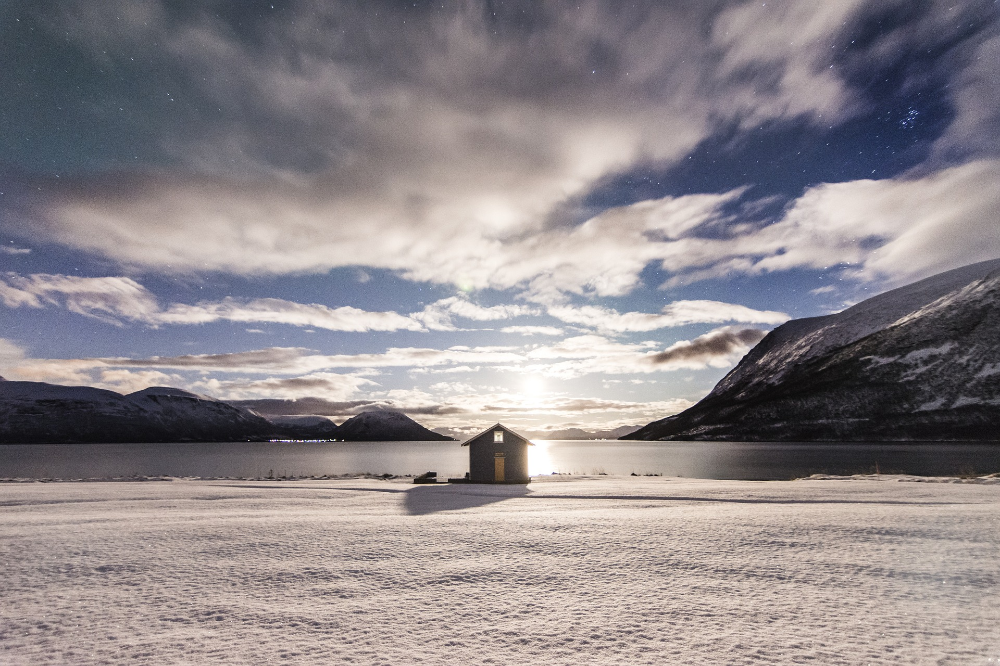

Image by <a href="https://pixabay.com/photos/?utm_source=link-attribution&amp;utm_medium=referral&amp;utm_campaign=image&amp;utm_content=1149223">Free-Photos</a> from <a href="https://pixabay.com/?utm_source=link-attribution&amp;utm_medium=referral&amp;utm_campaign=image&amp;utm_content=1149223">Pixabay</a>

### Collaborators
- Alessandro Filazzola (University of Toronto and York University)
- Sapna Sharma (York University)
- R. Iestyn Woolway (European Space Agency)
- M. Arshad Imrit (York University)


### Objective
- Evaluate patterns models of ice coverage globally with climate change

### Load packages
```{r warning=FALSE, message=FALSE}
library(raster)
library(ncdf4)
library(tidyverse)

```


### Read in files
```{r warning=FALSE, message=FALSE}
allfiles <- list.files("data//isimip_ice", full.names = T)

## Take a look at a raster
viewSample <- stack(allfiles[1])
plot(viewSample[[100]])

```


